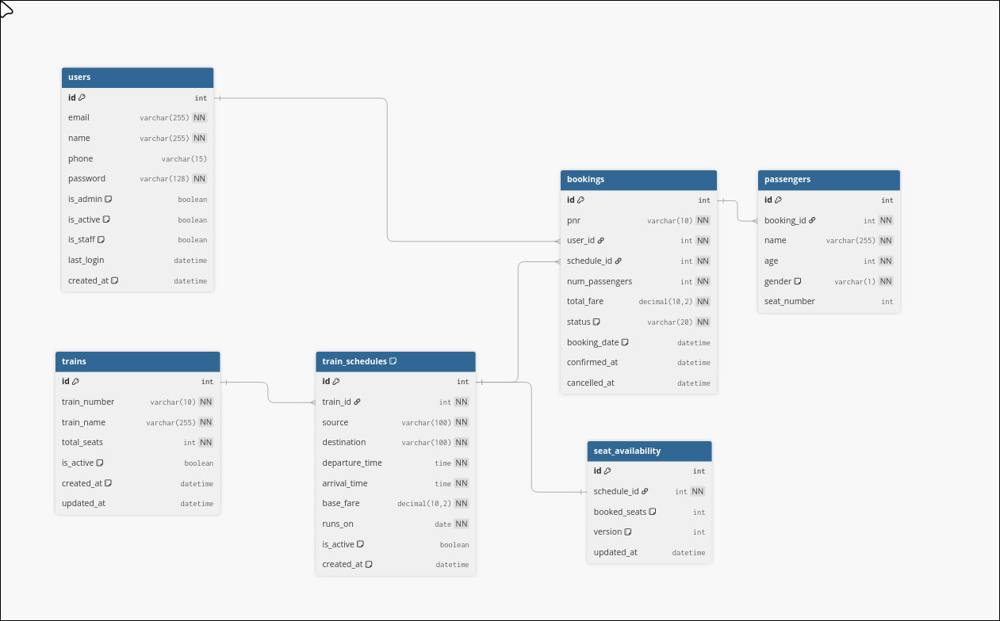
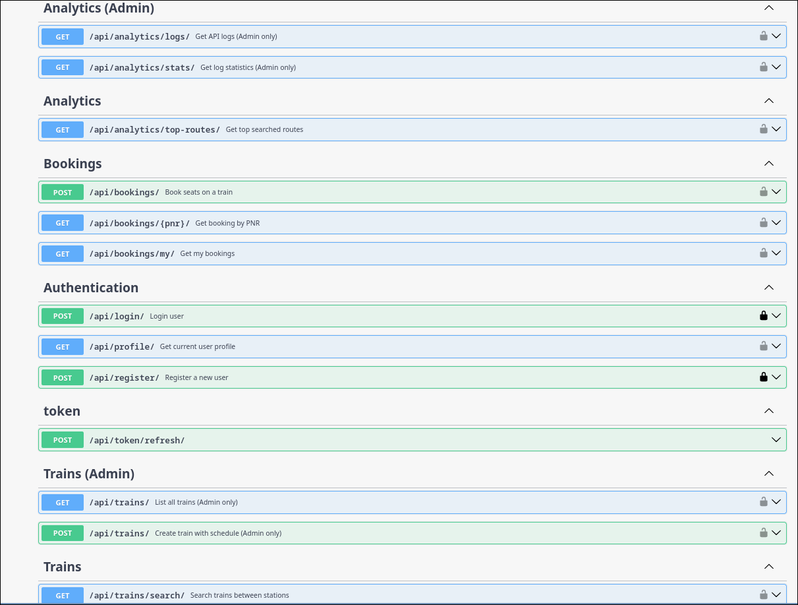

# IRCTC Backend API

A RESTful backend API for a simplified train booking system built with Django REST Framework.

## Table of Contents

- [Features](#features)
- [Tech Stack](#tech-stack)
- [Some Notable Design Decisions](#some-notable-design-decisions)
- [Database Schema](#database-schema)
- [Quick Start](#quick-start)
- [End-to-End Usage](#end-to-end-usage)
- [Testing](#testing)
- [API Endpoints](#api-endpoints)

---

## Features

- **User Authentication**: JWT-based registration, login, token refresh
- **Train Management**: Search trains, admin-only creation/update
- **Seat Booking**: Book seats with race condition handling (optimistic locking)
- **Analytics**: Top routes, API logs with production-ready filtering

## Tech Stack

| Component | Technology |
|-----------|------------|
| Framework | Django 5.0 + DRF |
| Database | SQLite (dev) / MySQL (prod) |
| Logging | MongoDB |
| Auth | JWT (SimpleJWT) |
| Docs | Swagger UI |

---

## Notable Design Decisions

**1. Database Split: MySQL + MongoDB**
- Bookings need ACID guarantees that MySQL provides, while logs are high-volume writes where MongoDB shines
- I rejected using a single PostgreSQL with JSONB columns because aggregation pipelines in MongoDB are more natural for analytics

**2. Refresh Tokens with Rotation**
- I went with JWT access tokens (short-lived, 60 min) paired with refresh tokens that rotate on each use
- This gives us stateless auth for scalability while limiting damage if a token leaks
- SimpleJWT's blacklisting ensures old refresh tokens can't be reused after rotation

**3. Simple `is_admin` Flag over Full RBAC**
- I rejected Django's groups/permissions system in favor of a simple boolean `is_admin` on the User model
- With only two roles (user and admin), a full RBAC implementation would be overengineering
- If we ever need roles like "train_operator" or "booking_agent", we can migrate to proper RBAC then

**4. Optimistic Locking for Seat Booking**
- For handling concurrent bookings, I chose optimistic locking with a `version` field over pessimistic locking
- Seat booking conflicts are rare (most trains have many seats), so pessimistic locking would create unnecessary lock contention
- With optimistic locking, we attempt the update and gracefully retry if the version changed

**5. MongoDB Graceful Degradation**
- I made a deliberate choice that MongoDB being unavailable should never break the booking flow
- All mongo functions return empty results on failure rather than raising exceptions
- Logging is important but not critical path

---

## Database Schema

### ER Diagram (MySQL)



### MongoDB Schema (API Logs)

```json
{
  "_id": ObjectId("..."),
  "endpoint": "/api/trains/search/",
  "method": "GET",
  "user_id": 1,
  "request_params": { "source": "Delhi", "destination": "Mumbai" },
  "response_status": 200,
  "execution_time_ms": 45.23,
  "timestamp": ISODate("2026-01-08T10:30:00Z")
}
```

### API Documentation (Swagger UI)



---

## Quick Start

### Option 1: Docker (Recommended)

```bash
git clone <repo-url> && cd irctc-backend-assignment

# Start all services
docker-compose up --build

# Access: http://localhost:8000/api/docs/
```

### Option 2: Local Development

```bash
# Setup
python -m venv venv && source venv/bin/activate
pip install -r requirements.txt
cp .env.example .env

# Run
python manage.py migrate
python manage.py seed_db
python manage.py runserver
```

---

## End-to-End Usage

### 1. Open Swagger UI
```
http://localhost:8000/api/docs/
```

### 2. Register
```bash
curl -X POST http://localhost:8000/api/register/ \
  -H "Content-Type: application/json" \
  -d '{"email":"user@test.com","name":"Test","password":"Test@123","password_confirm":"Test@123"}'
```

### 3. Login
```bash
curl -X POST http://localhost:8000/api/login/ \
  -H "Content-Type: application/json" \
  -d '{"email":"user@test.com","password":"Test@123"}'
```

### 4. Search Trains (use token from login)
```bash
curl "http://localhost:8000/api/trains/search/?source=Delhi&destination=Mumbai" \
  -H "Authorization: Bearer <token>"
```

### 5. Book Seats
```bash
curl -X POST http://localhost:8000/api/bookings/ \
  -H "Authorization: Bearer <token>" \
  -H "Content-Type: application/json" \
  -d '{"schedule_id":1,"passengers":[{"name":"John","age":30,"gender":"M"}]}'
```

---

## Testing

```bash
# Run all 66 tests
python manage.py test

# Verbose
python manage.py test -v2

# Specific app
python manage.py test core trains bookings analytics
```

**Test Credentials (after seeding):**
| Role | Email | Password |
|------|-------|----------|
| Admin | admin@irctc.com | Admin@123 |
| User | john@example.com | User@123 |

---

## API Endpoints

| Method | Endpoint | Auth | Description |
|--------|----------|------|-------------|
| POST | `/api/register/` | - | Register user |
| POST | `/api/login/` | - | Login |
| POST | `/api/token/refresh/` | - | Refresh token |
| GET | `/api/trains/search/` | User | Search trains |
| POST | `/api/trains/` | Admin | Create train |
| POST | `/api/bookings/` | User | Book seats |
| GET | `/api/bookings/my/` | User | My bookings |
| GET | `/api/analytics/top-routes/` | User | Top routes |
| GET | `/api/analytics/logs/` | Admin | API logs |
| GET | `/api/analytics/stats/` | Admin | Aggregated stats |

### API Logs Filters

`GET /api/analytics/logs/` supports the following query parameters:

| Parameter | Type | Description |
|-----------|------|-------------|
| `limit` | int | Results per page (default: 50, max: 500) |
| `offset` | int | Pagination offset |
| `endpoint` | string | Filter by path (e.g., `/api/trains/search/`) |
| `user_id` | int | Filter by user ID |
| `status_code` | int | Filter by HTTP status (200/400/500) |
| `method` | string | Filter by method (GET/POST) |
| `min_time_ms` | float | Slow queries (e.g., `1000` for >1s) |
| `start_date` | string | After date (YYYY-MM-DD) |
| `end_date` | string | Before date (YYYY-MM-DD) |

**Examples:**
```bash
# Recent 10 logs
GET /api/analytics/logs/?limit=10

# All errors in date range
GET /api/analytics/logs/?status_code=500&start_date=2026-01-01

# Slow queries (>1 second)
GET /api/analytics/logs/?min_time_ms=1000

# Specific endpoint logs
GET /api/analytics/logs/?endpoint=/api/trains/search/&limit=100
```

